# Customer Support Chatbot with Amazon Bedrock

## 📌 Overview

This project is a customer support chatbot for an online shop. The chatbot uses Amazon Bedrock, Amazon Bedrock AgentCore, AWS Lambda, Amazon DynamoDB, Amazon S3, and Amazon Bedrock Evaluations.

The main goal of the project was to use **prompt engineering** to make the chatbot understand different types of customer requests and handle each request in the correct way.

The chatbot classifies customer messages into three categories:

| Category | Purpose |
|---|---|
| 🐛 Bug Report | Collects the required bug details and creates a support ticket |
| 💬 Platform Question | Answers supported questions using the provided FAQ |
| 👤 Other Request | Directs unsupported requests to human support |

---

## 🏗️ Architecture

The project uses Amazon Bedrock AgentCore to run the customer support chatbot and connect it to the required tools.

```text
                         Customer
                            │
                            ▼
                 Amazon Bedrock / Nova Pro
                            │
                            ▼
                  AgentCore Harness
                            │
                 Request Classification
                ┌───────────┼───────────┐
                │           │           │
                ▼           ▼           ▼
           Bug Report   Platform     Other
                         Question     Request
                │           │           │
                ▼           ▼           ▼
        AgentCore        FAQ         Human
         Gateway       Response      Support
                │
                ▼
           AWS Lambda
       create_bug_report
                │
                ▼
          DynamoDB
       Bug Report Storage

       Supporting Services:
       ├── Amazon S3
       └── Bedrock Evaluations
```

---
### Architecture in Amazon Bedrock

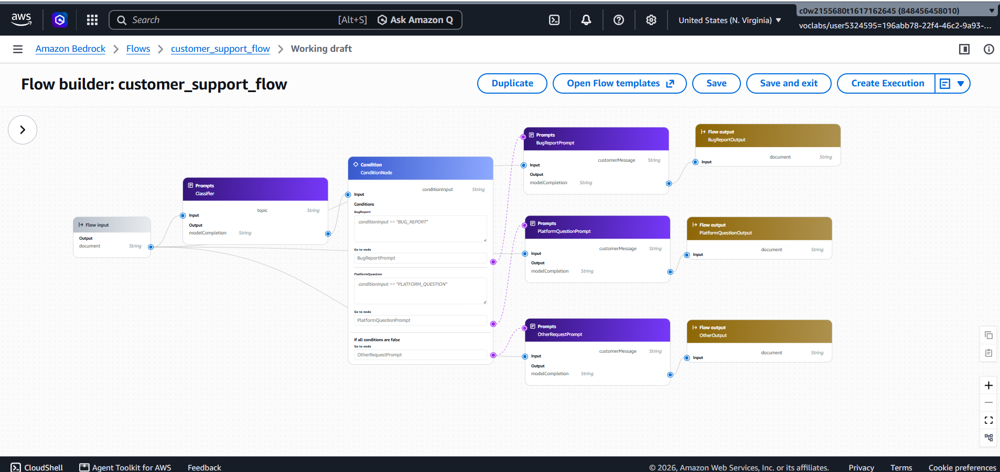

## 🔀 Request Routing

The system prompt defines three possible paths for every customer message.

### Classifier Prompt Evidence

The classifier prompt explicitly instructs the model to classify each incoming customer message into one of three categories and return only the expected category value.

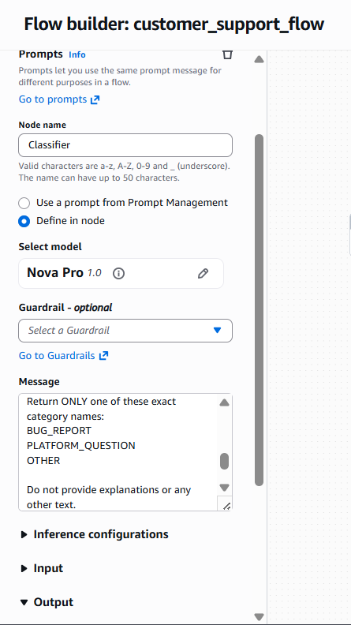

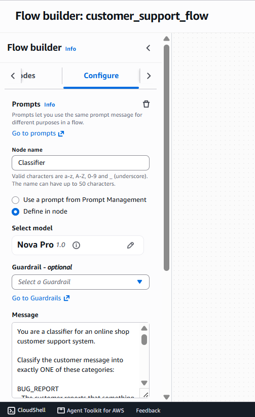

### 1. 🐛 Bug Report

A message is treated as a bug report when the customer says something on the website or application is broken or not working.

Before creating a ticket, the chatbot must collect:

1. A description of the bug
2. Steps to reproduce the bug
3. The customer's environment, including browser, operating system, and device

The chatbot asks for missing information one question at a time.

Only after all three details are available does it call the `create_bug_report` tool.

### 2. 💬 Platform Question

Platform questions include topics such as:

- Orders
- Shipping
- Returns
- Refunds
- Payments
- Products
- Accounts
- Privacy

The chatbot answers these questions using the provided `online_shop_faq.md` document.

It should not invent policies that are not present in the FAQ.

### FAQ Prompt Evidence

The Platform Question path uses the `PlatformQuestionPrompt` node with the embedded Online Shop FAQ as the source for supported customer questions.

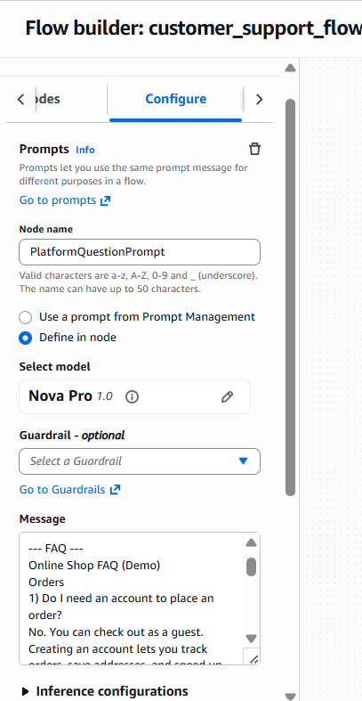

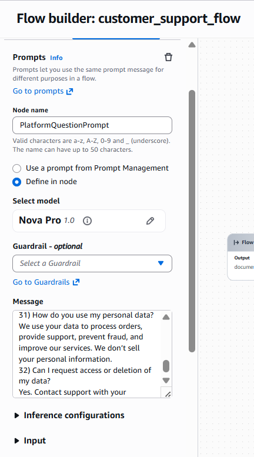

### 3. 👤 Other Request

Requests that are not bug reports and cannot be answered using the FAQ are treated as other requests.

For these requests, the chatbot politely explains that it cannot help and directs the customer to the human support line.

---

## 🐛 Bug Report Workflow

The bug-report workflow is designed as a multi-turn conversation.

### Example

**Customer:**

> The checkout button is not working.

**Chatbot:**

> Could you please describe the issue with the checkout button in more detail? What happens when you try to click it?

**Customer:**

> I click the checkout button after adding an item to my cart, but nothing happens.

**Chatbot:**

> Could you please provide the steps you took leading up to the problem?

**Customer:**

> I added an item to the cart, opened the cart, clicked the checkout button, and nothing happened.

**Chatbot:**

> Which browser and operating system are you using, and are you on a desktop or mobile device?

**Customer:**

> Chrome on Windows 11, using a laptop.

**Chatbot:**

> Your bug report has been successfully submitted. Your ticket ID is `TICKET-ID`. The engineering team will follow up with you.

At this point, the `create_bug_report` tool is called.

I also verified the created bug report in Amazon DynamoDB and confirmed that the ticket contained the required information.

### Actual Chatbot Test

The following screenshot shows the multi-turn bug-report conversation, including collecting the bug description, reproduction steps, environment, and creating the bug report.

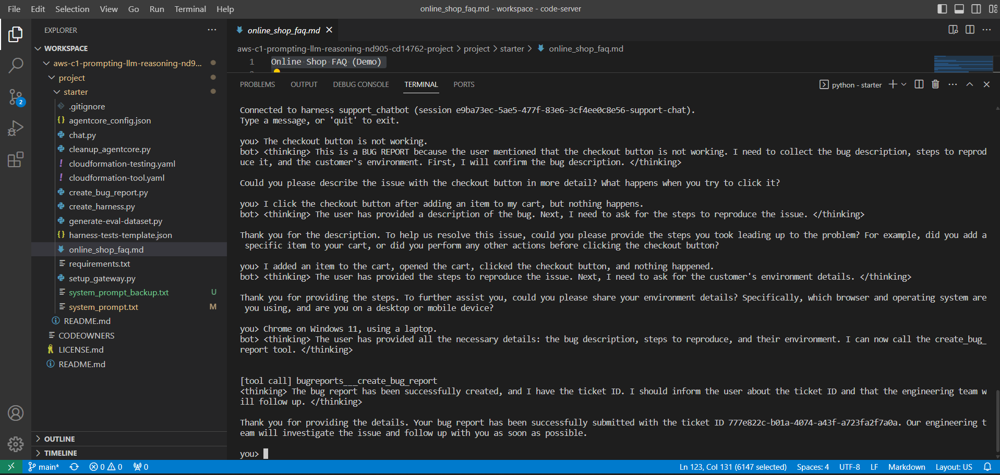

---

## 🔒 Tool-Call Gate

One of the important prompt refinements in this project was adding an explicit **tool-call gate**.

The system prompt tells the chatbot:

- Do not call `create_bug_report` when required information is missing.
- Verify that the bug description is present.
- Verify that the reproduction steps are present.
- Verify that the environment is present.
- If any information is missing, ask for exactly one missing detail.
- Wait for the customer's response before continuing.
- Only call the tool after all required information is available.

This was added to make the tool usage more reliable.

---

## 🤖 Prompt Engineering

The main system prompt is located at:

```text
starter/system_prompt.txt
```

The prompt gives the chatbot clear instructions for:

- Request classification
- Bug-report information collection
- Tool usage
- FAQ-based answers
- Unsupported requests

The prompt also explicitly tells the model to avoid fabricating information.

The final prompt refinement added a stronger tool-call gate to reduce the chance of creating a bug ticket before the customer has provided all required information.

---

## ☁️ AWS Services Used

| AWS Service | Purpose |
|---|---|
| Amazon Bedrock | Provides the foundation model used by the chatbot |
| Amazon Bedrock AgentCore Harness | Runs the chatbot and manages the conversation/tool execution |
| AgentCore Gateway | Connects the chatbot to the bug-report tool |
| AWS Lambda | Implements the `create_bug_report` functionality |
| Amazon DynamoDB | Stores created bug reports |
| Amazon S3 | Stores evaluation datasets and evaluation results |
| Amazon Bedrock Evaluations | Evaluates chatbot responses |
| AWS CloudFormation | Deploys the supporting AWS resources |

---

## 🧪 Testing

I created a test suite containing six test cases:

```text
starter/harness-tests.json
```

The tests cover the main behaviors of the chatbot.

| Test Case | What it tests |
|---|---|
| Bug report - missing details | Whether the chatbot asks for missing bug information |
| Delivery question | FAQ-based shipping answer |
| Refund question | FAQ-based refund answer |
| Privacy question | FAQ-based privacy answer |
| Other request | Handling an unsupported request |
| Complete bug report | Creating a bug ticket when all details are available |


The evaluation dataset was generated using:

```bash
python generate-eval-dataset.py --tests-json harness-tests.json
```
### FAQ and Request Routing Tests

#### Delivery Question

The chatbot successfully handled a delivery question using the provided FAQ.

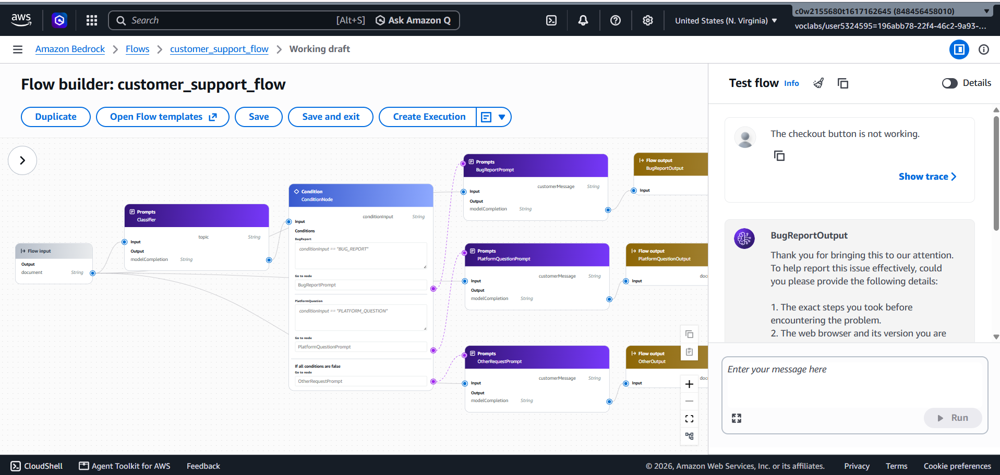

### Uncovered FAQ Question

The chatbot also handles questions that are not covered by the FAQ. In this case, it explains that the request is outside the supported FAQ and directs the customer to the human support phone number.

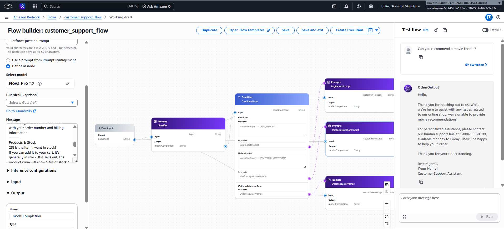

#### Other Request

The chatbot recognized an unsupported request and provided the appropriate human-support response.

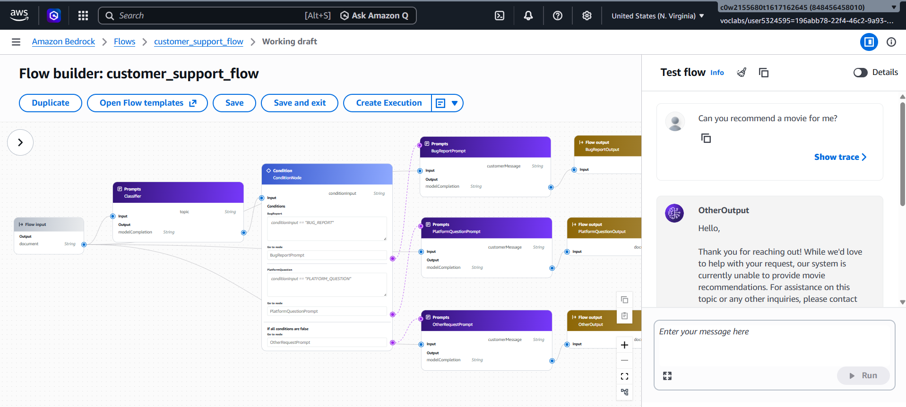

#### Privacy Question

The chatbot handled a privacy-related question using the provided FAQ.

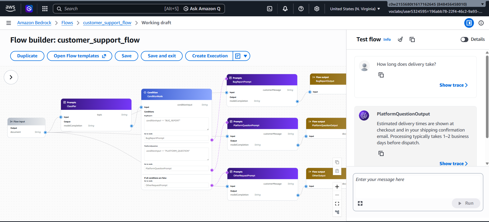

---

## 📊 Evaluation Results

The generated evaluation dataset was evaluated using **Amazon Bedrock Evaluations** with the `Builtin.Correctness` metric.

The completed evaluation produced the following results:

| Test Case | Correctness | Result |
|---|---:|---|
| Bug report - missing details | 0.0 | ❌ Failed |
| Delivery question | 1.0 | ✅ Passed |
| Refund question | 1.0 | ✅ Passed |
| Privacy question | 1.0 | ✅ Passed |
| Other request | 1.0 | ✅ Passed |
| Complete bug report | 1.0 | ✅ Passed |
| **Overall** | **5/6** | **83.3%** |

### Overall Result

**5 out of 6 test cases were judged correct, giving an overall correctness score of 83.3%.**

The missing-details test was the only failed automated test.

The important detail is that the evaluation dataset was generated before the final prompt refinement that added the stronger tool-call gate.

After the refinement, I manually tested the multi-turn bug-report workflow. The chatbot successfully:

1. Recognized the request as a bug report.
2. Asked for the missing information one question at a time.
3. Collected the bug description.
4. Collected the reproduction steps.
5. Collected the environment.
6. Called the `create_bug_report` tool.
7. Returned the generated ticket ID.

The created ticket was also verified in DynamoDB.

### Bedrock Evaluation Evidence

The evaluation was run as an Amazon Bedrock Evaluation job using the `Builtin.Correctness` metric.

The completed evaluation job and its reported metrics are shown below.

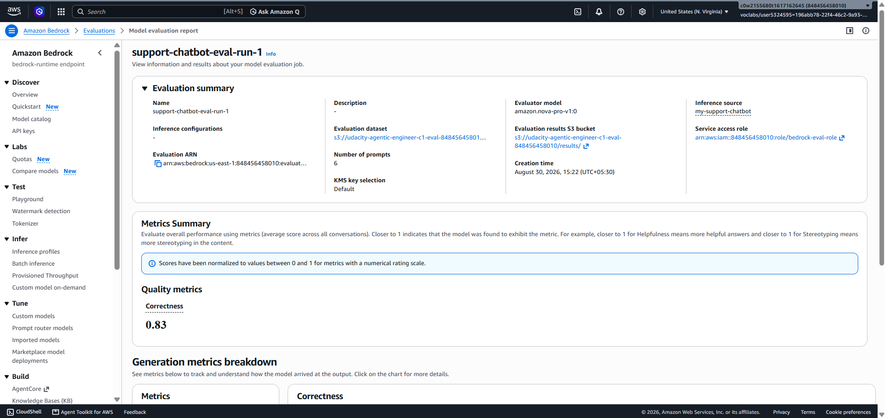

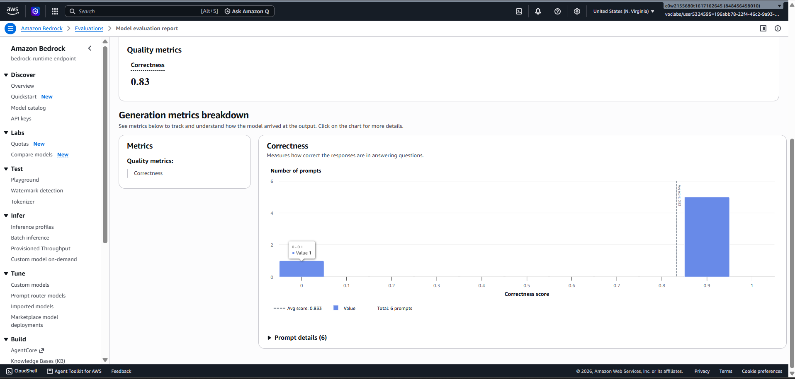

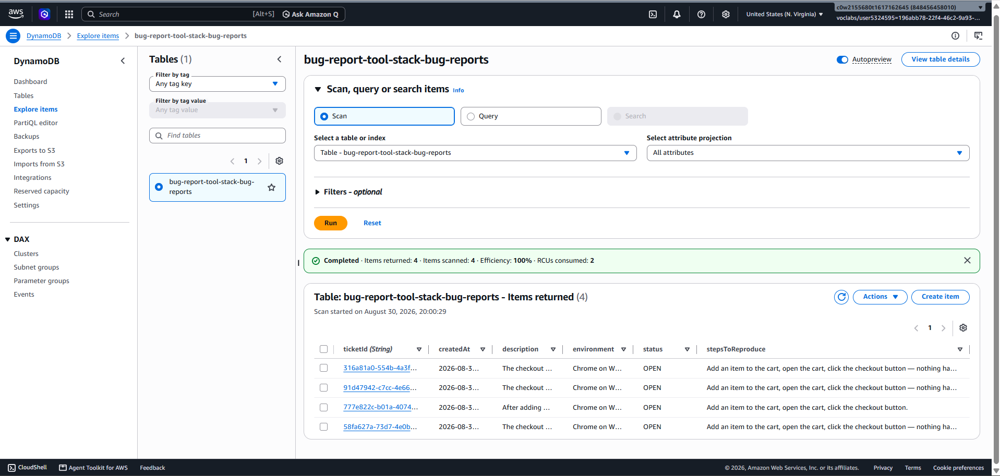

---

## 🗄️ Bug Report Storage

The bug-report tool stores information in Amazon DynamoDB.

### DynamoDB Evidence

The completed bug report is persisted in the `bug-report-tool-stack-bug-reports` DynamoDB table.

The table contains the generated ticket and the information collected during the conversation.

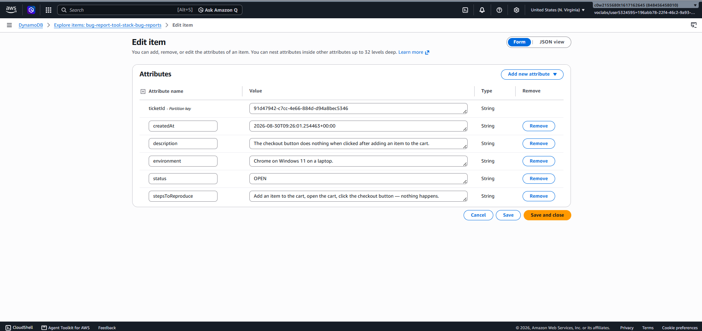

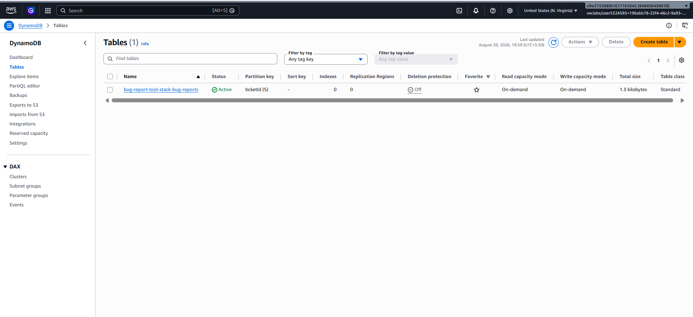

A successfully created record contains fields such as:

```text
ticketId
description
stepsToReproduce
environment
status
createdAt
```

Example structure:

```json
{
  "ticketId": "generated-ticket-id",
  "description": "After adding an item to the cart and clicking checkout, nothing happens.",
  "stepsToReproduce": "Add an item to the cart, open the cart, click the checkout button.",
  "environment": "Chrome on Windows 11, using a laptop.",
  "status": "OPEN"
}
```

This confirms that the chatbot is not only generating a response but is also able to use an AWS tool to create and store a real bug report.

---

## 📁 Important Project Files

```text
project/
├── README.md
├── PROJECT_SUMMARY.md
└── starter/
    ├── system_prompt.txt
    ├── harness-tests.json
    ├── evaluation_results.jsonl
    ├── online_shop_faq.md
    ├── chat.py
    ├── create_harness.py
    ├── create_bug_report.py
    ├── setup_gateway.py
    ├── generate-eval-dataset.py
    ├── cloudformation-tool.yaml
    ├── cloudformation-testing.yaml
    └── requirements.txt
```

The original Udacity `README.md` is kept unchanged.

Generated configuration and temporary files such as:

```text
agentcore_config.json
output_eval_dataset.jsonl
```

are excluded from Git.

---

## ▶️ Running the Project

Install the required Python packages:

```bash
pip install -r starter/requirements.txt
```

After the required AWS resources have been configured, start the chatbot with:

```bash
cd starter
python chat.py
```

To generate the evaluation dataset:

```bash
cd starter
python generate-eval-dataset.py --tests-json harness-tests.json
```

---

## 💡 What I Learned

This project helped me understand how prompt engineering can be used to control the behavior of an AI assistant.

Some of the main things I learned were:

- How to design a system prompt with clear routing rules
- How to create a multi-turn conversation workflow
- How to collect required information before using a tool
- How to connect an AI assistant to an AWS tool using AgentCore Gateway
- How AWS Lambda can be used to implement a tool
- How to store chatbot-generated information in DynamoDB
- How to create independent test cases for an AI application
- How to use Amazon Bedrock Evaluations to measure response correctness
- How to refine a prompt based on testing results
- How to use Git and GitHub to manage the project

---

## 🎯 Final Result

The completed chatbot can:

- Classify customer requests into the correct category
- Handle multi-turn bug-report conversations
- Collect the required bug information before creating a ticket
- Create bug reports through an AWS tool
- Store bug reports in DynamoDB
- Answer supported platform questions using the provided FAQ
- Redirect unsupported requests to human support
- Be tested using an automated evaluation workflow

The automated evaluation achieved:

> **83.3% correctness (5/6 test cases)**

The final manual test also confirmed the intended multi-turn bug-report workflow after the prompt refinement.